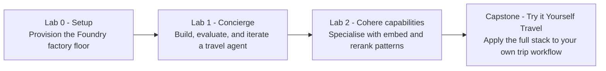

# Building and Optimizing your AI Agents With Microsoft Foundry and Cohere

> A hands‑on workshop for technical learners (L200–L400) that walks you through deploying Cohere models on **Microsoft Foundry**, then building an agentic travel‑concierge AI app with **Cohere Command A+**, andexploring specialized Cohere capabilities (embed, business graphs, rerank).

## Pre-Requisites
This workshop assumes you can run Azure CLI commands and work in Python notebooks. You do not need to know Microsoft Foundry or Cohere yet. 

Microsoft Foundry is the platform where you will create projects, deploy models, build agents, and check how they behave. Cohere is the model provider you will use for chat, embedding, and rerank tasks.

You will practice the **build → evaluate → analyse → iterate** loop. That means you build a first version, measure it, study the results, and improve it. The goal is not only to call an API. The goal is to learn how teams make an AI app safer, easier to inspect, and more useful over time.

---

## 1. The story

Imagine you are the platform engineer for a corporate **travel concierge**. Employees ask it to book flights, hotels, and cars. It must also follow the company's travel policy, even when a traveler asks for something expensive or out of policy.

Think of Foundry as a car factory. A **deployment** is a model made ready to use, like an engine installed on the factory floor. A **prompt agent** is an AI helper with instructions, a model, and tools, like a car chassis with the engine and controls added. In this workshop, the travel concierge is the car you assemble and test.

You will:

1. **Stand up Foundry** with four model deployments (Lab 0).
2. **Build the concierge end‑to‑end** with Command A — tools, grounding, three rounds
   of evaluation, a cloud red‑team scan, and a load test that lights up the
   Monitoring tab (Lab 1).
3. **Specialise** by exploring Cohere's other models on travel‑themed tasks —
   embeddings for trip similarity, business graphs for entity relationships,
   rerank for ranking shortlists (Lab 2).

By the end, you can deploy Cohere models on Foundry, run an agent development loop, and choose the right Cohere model for the job. An **embedding** is a list of numbers that captures the meaning of text or an image, so similar items can be found even when they use different words. **Rerank** means taking a first list of possible results and sorting it again based on what the user really wants.

**Figure 1 — Workshop arc.**

---

## 2. What you will build

| Lab | Folder | What it produces | Time estimate |
| --- | ------ | ---------------- | ------------- |
| **Lab 0 — Setup** | [`lab-0-setup/`](./lab-0-setup) | A resource group with a Foundry account, project, and four model deployments (`command-a`, `embed-v-4-0`, `Cohere-rerank-v4.0-pro`, `text-embedding-3-small`) and a populated `.env`. | ~20 min |
| **Lab 1 — Build a Multi-Agent Concierge with the Microsoft Agent Framework** | [`lab-1-foundry-maf/`](./lab-1-foundry-maf) | A local multi-agent travel concierge built with the open-source Microsoft Agent Framework (MAF) using Cohere `command-a` deployed in Microsoft Foundry: orchestrator + flight/hotel/car specialists with booking tools, OpenTelemetry tracing, a four-round evaluation arc (baseline → grounded → custom policy evaluator → multi-agent), and a local red-team scan. | ~90 min |
| **Lab 2 — Explore Cohere Model Capabilities** | [`lab-2-cohere-capabilities/`](./lab-2-cohere-capabilities) | Three vendor capability notebooks (`lab-2a`/`lab-2b` embed, `lab-2c` rerank), two optional rerank deep-dives, and a "Try it Yourself: Travel" capstone notebook that connects what you learned back to the Lab 1 scenario. | ~70 min |

An **evaluator** is a checker that scores an AI answer, like a reviewer who checks whether the concierge followed policy. A **red-team** scan is a safety test where prompts try to make the agent break rules. **App Insights**, short for Application Insights, collects app logs and timing data so you can see what happened during a run.

Total: a 3-4 hr workshop.

---

## 3. Prerequisites

- An Azure subscription with rights to create a resource group, an AI Services
  (Foundry) account, a project, and the four model deployments listed above in
  **eastus2** (or another region that hosts all four).
- `az` CLI logged in (`az login`).
- Python 3.10+ (the devcontainer installs everything from
  [`requirements.txt`](./requirements.txt) automatically in Codespaces).

If your organisation has already provisioned a Foundry project for you, skip the provisioning step in Lab 0 and run only `setup-env.sh`. A **Foundry project** is the workspace inside Foundry where your deployments, agents, evaluations, and monitoring views live.

---

## 4. Conventions

- **Notebooks**: alternating markdown / code cells with numbered sections. Every
  notebook opens with a **Scenario** section, lists **What you will do**, and ends
  with **What you learned (3 takeaways)**. Each notebook shows its own time
  estimate.
- **Analogies first.** Complex concepts are introduced with the travel concierge or car factory story before the technical details. The analogy gives you a mental picture before you read code.
- **Env vars** live in [`sample.env`](./sample.env). Lab 0 copies it to `.env` and
  fills in concrete values. Notebooks load `.env` via `python-dotenv`.
- **SDKs**: we prefer the new Foundry SDK (`azure-ai-projects`) and use the
  Cohere SDK only when needed for correct inference patterns.

---

## 5. Get started

Use GitHub Codespaces as the primary setup path:

1. Click **Code → Codespaces → Create codespace on main** on this repository.
2. Wait for the devcontainer to finish building. Dependencies install automatically via `.devcontainer/post-create.sh` → root `requirements.txt` → `cohere/requirements.txt`. No `pip install` needed.
3. Authenticate with Azure: `az login --use-device-code`. Codespaces cannot open a local browser, so the device-code flow is required.
4. Choose ONE of:
   - **Pre-provisioned RG** (workshop facilitator gave you one): `cd cohere/lab-0-setup && ./setup-env.sh RESOURCE_GROUP_NAME`
   - **Self-provision**: `cd cohere/lab-0-setup && ./provision.sh && ./setup-env.sh $RESOURCE_GROUP`
5. Sanity-check the deployments: `./verify.sh`.

Local setup (alternative): if you are not using Codespaces, follow [`lab-0-setup/SETUP.md`](./lab-0-setup/SETUP.md) for local prerequisites and setup commands.

Then open `lab-1-foundry-maf/README.md` and follow the notebook sequence.

### Troubleshooting

**Lab 1 chat calls return `Project not found` (HTTP 404) or `DeploymentNotFound` from a `FoundryChatClient`.**

This lab does NOT use `FoundryChatClient`. It uses MAF's `OpenAIChatClient` pointed at the Foundry account-level `/openai/v1` endpoint (`AZURE_AI_ENDPOINT/openai/v1`), which serves both the chat completions and responses APIs. Two reasons:

- The project-scoped path (`.../api/projects/
/openai/v1/...`) can return `Project not found` for **5–15+ minutes** after a fresh Foundry project is provisioned, while the account-level path works immediately.
- Even after propagation, the project-scoped Responses API path returns intermittent 404s at the service layer (observed ~40% failure rate). The account-level path is consistently 100% reliable in our testing.

If you see this error, check that:
1. Your `cohere/.env` has `AZURE_AI_ENDPOINT` set.
2. `agents/travel_agents.py`'s `make_chat_client` builds the URL as `f"{AZURE_AI_ENDPOINT.rstrip('/')}/openai/v1"`.
3. The `verify.sh` line `Command A via MAF OpenAIChatClient path (Responses API) returned HTTP 200` passes.

**`verify.sh` shows the account-level Responses probe failing right after provisioning.**

Rare: deployment registration on the inference backend can lag deployment creation by 1–3 minutes. Wait 2 minutes and re-run `./verify.sh` (the script already retries 3 times per check).
