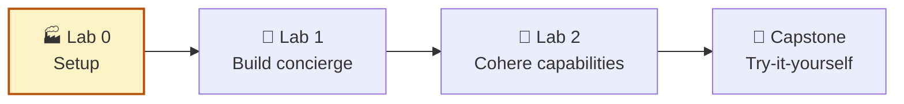
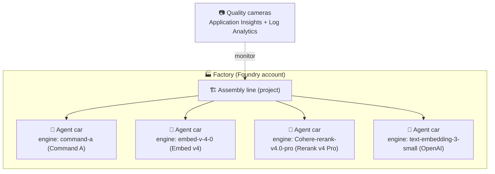
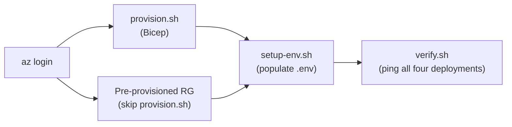

# Lab 0 — Setup

> ⏱ ~20 min · provisioning + env wiring · prerequisites: Azure subscription with contributor rights in `eastus2`
>
> **How to run:** work through sections 1 → 10 in order. Sections 3 (Codespaces) and 4 (Local) are alternatives — pick one. Section 7 is for learners using a pre-provisioned resource group.

**You are here:**



## 1. Scenario

You are the platform engineer setting up the **factory floor** that will assemble every AI agent in this workshop. Before anything else can happen — no concierge, no embeddings, no rerank — the factory itself has to exist and be wired up.

Think of **Microsoft Foundry as a car assembly line**. A **Foundry account** is the factory building. A **Foundry project** is one assembly line inside that factory. A **deployment** is a model that has been made ready to call, like an engine installed and tested before it goes into a car.

The **model** is the engine. The **agent** is the car chassis with its body and features bolted on. The **instructions** you give the agent are the owner's manual. Foundry assembles each car starting with the engine, then adding the body and features so the car does what the customer needs — a race car for speed, a truck for hauling, or a sedan for commuting. Lab 0 stands up the factory, stocks four engines, and turns on the line cameras. Those cameras are **Application Insights**, a service that records app activity so you can monitor later labs.

**Figure 1 — Foundry factory topology.**



## 2. What you will do

1. Provision an Azure resource group in `eastus2` with:
   - a Microsoft Foundry account (`Microsoft.CognitiveServices/accounts`, `kind=AIServices`, `sku.name=S0`),
   - a Foundry project child resource,
   - four model deployments on the account,
   - a Log Analytics workspace,
   - a workspace-based Application Insights component.
2. Populate `../.env` from `../sample.env` using values discovered from Azure.
3. Verify every deployment exists and responds to a small inference request.

An **inference request** is a call where you send input to a model and get output back. The setup is not finished until the deployments answer a real request, because a deployment can exist but still fail when called.

**Figure 2 — Provisioning happy path.**



## 3. GitHub Codespaces setup (recommended)

Use GitHub Codespaces first for this workshop. The repository opens with the devcontainer, and dependencies install automatically via `.devcontainer/post-create.sh`, the root `requirements.txt`, and `cohere/requirements.txt`; you do not need to run `pip install` in Codespaces.

1. Click **Code → Codespaces → Create codespace on main** on this repository.
2. Wait for the devcontainer build and post-create install to finish.
3. Authenticate with Azure from the Codespaces terminal:

   ```bash
   az login --use-device-code
   ```

   Codespaces cannot open a local browser, so use the device-code flow instead of plain `az login`.
4. Choose one resource group flow:
   - **Pre-provisioned RG** (workshop facilitator gave you one):

     ```bash
     cd cohere/lab-0-setup
     ./setup-env.sh RESOURCE_GROUP_NAME
     ```

   - **Self-provision** your own resource group and Foundry resources:

     ```bash
     cd cohere/lab-0-setup
     export RESOURCE_GROUP=rg-mm-cohere-workshop
     ./provision.sh
     ./setup-env.sh $RESOURCE_GROUP
     ```

5. Verify every deployment before starting Lab 1:

   ```bash
   ./verify.sh
   ```

You still need an Azure subscription or pre-provisioned resource group with quota/capacity in `eastus2` for these deployments. **Quota** is your allowed amount of model capacity in a region. **Capacity** is how much serving power you reserve for the deployment.

| Deployment | Catalog model | Format | Capacity |
| --- | --- | --- | --- |
| `text-embedding-3-small` | `text-embedding-3-small` | OpenAI | 120 |
| `command-a` | `cohere-command-a` | Cohere | 1 |
| `Cohere-rerank-v4.0-pro` | `Cohere-rerank-v4.0-pro` | Cohere | 1 |
| `embed-v-4-0` | `embed-v-4-0` | Cohere | 1 |

## 4. Local setup (alternative)

Use this path only if you are not using Codespaces.

- Azure CLI installed and authenticated: `az login`.
- Python 3.10+.
- An Azure subscription where you can create resource groups, AI Services accounts, deployments, Log Analytics workspaces, and Application Insights components.
- Quota/capacity in `eastus2` for the deployments listed above.

Install Python dependencies from the repository root:

```bash
pip install -r requirements.txt
pip install -r cohere/requirements.txt
```

Then choose the same pre-provisioned or self-provision flow from the Codespaces section, using `az login` instead of `az login --use-device-code` if your terminal can open a browser.

## 5. Provision with Bicep

From this folder:

```bash
cd cohere/lab-0-setup
RESOURCE_GROUP=rg-mm-cohere-workshop ./provision.sh
```

`provision.sh` is intentionally small and idempotent. **Idempotent** means you can run it more than once and it will try to leave the environment in the same desired state instead of creating duplicates.

1. It reads `RESOURCE_GROUP` from the environment, the first argument, or an interactive prompt.
2. It uses `LOCATION=eastus2` unless you override `LOCATION`.
3. It creates the resource group if needed.
4. It runs `az deployment group create` against `bicep/main.bicep` and `bicep/main.parameters.json`.
5. It prints deployment outputs, including the Foundry account endpoint, project endpoint, and App Insights connection string.

The Bicep template keeps the model list declarative through the `deployments` array parameter. **Declarative** means the file describes the final resources you want, not every manual click. The deployments use `@batchSize(1)` so ARM creates them one at a time, which reduces throttling and capacity-race failures.

## 6. Populate `../.env`

After provisioning finishes, run:

```bash
RESOURCE_GROUP=rg-mm-cohere-workshop ./setup-env.sh
```

The script copies `../sample.env` to `../.env` and fills only the standard variables used by the workshop. The `.env` file is your local settings sheet. It tells the notebooks which project, endpoints, and deployments to use.

- Azure identity and location values,
- Foundry account and project names,
- account and project endpoints,
- actual deployment names discovered by catalog model name,
- Cohere vendor SDK base URLs and API keys for embed/rerank notebooks,
- the Application Insights connection string.

If `../.env` already exists, the script refuses to overwrite it. Use `--force` when you intentionally want to regenerate it:

```bash
RESOURCE_GROUP=rg-mm-cohere-workshop ./setup-env.sh --force
```

## 7. Alternative path: use a pre-provisioned resource group

If an instructor or administrator already created the resource group, skip `provision.sh` and run only:

```bash
cd cohere/lab-0-setup
RESOURCE_GROUP=<existing-resource-group> ./setup-env.sh
```

`setup-env.sh` discovers the AIServices account, first Foundry project, deployments, account key, and App Insights component in that resource group. Deployment environment variables are matched by `properties.model.name`, so the script still works if the deployment names have different casing.

This path is useful in classrooms. Learners can share a prepared factory floor and still get their own local `.env` values for the notebooks.

## 8. Verify the setup

Run:

```bash
./verify.sh
```

`verify.sh` sources `../.env`, confirms the four deployments exist on the Foundry account, checks model catalog lookup commands, and sends a small request to each endpoint:

- OpenAI embeddings through `/openai/deployments/.../embeddings`,
- Command A through `/providers/cohere/v2/chat`,
- Embed v4 through `/providers/cohere/v2/embed`,
- Rerank v4 through `/providers/cohere/v2/rerank`.

Each check prints `PASS` or `FAIL`. Resolve all failures before starting Lab 1. A failed check usually means the factory is missing an engine, an endpoint value is wrong, or Azure capacity is not ready yet.

## 9. Portal click-through appendix

To inspect the result manually:

1. Open the Azure portal and go to the resource group.
2. Open the AI Services / Foundry account named `mm-cohere-workshop` unless you changed parameters.
3. Confirm the child project `mm-cohere-project` exists.
4. Open model deployments and confirm the four deployment names listed above.
5. Open the Application Insights component and confirm it is connected to the Log Analytics workspace.
6. In the Foundry portal, open the project and use the Monitoring tab in Lab 1 after the load test generates telemetry.

**Telemetry** is recorded data about what the app did, such as calls, timings, errors, and model usage. You turn it on now so later labs can show evidence instead of guesses.

## 10. What you learned

1. A Foundry workshop environment is an AIServices account plus a project and account-level model deployments.
2. Bicep makes the setup repeatable, while `setup-env.sh` makes both new and pre-provisioned resource groups notebook-ready.
3. Verification should test both control-plane discovery and real inference calls before learners move on.

---

**Next →** [Lab 1 — Build the multi-agent travel concierge with MAF](../lab-1-foundry-maf/README.md) · **↑** [Workshop home](../README.md)
