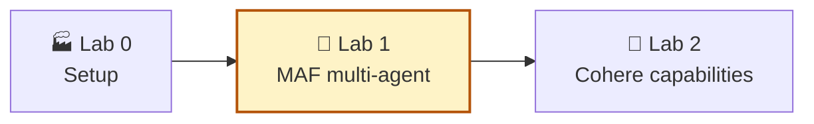
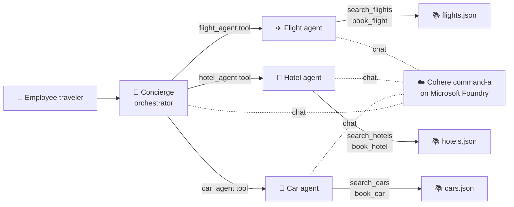
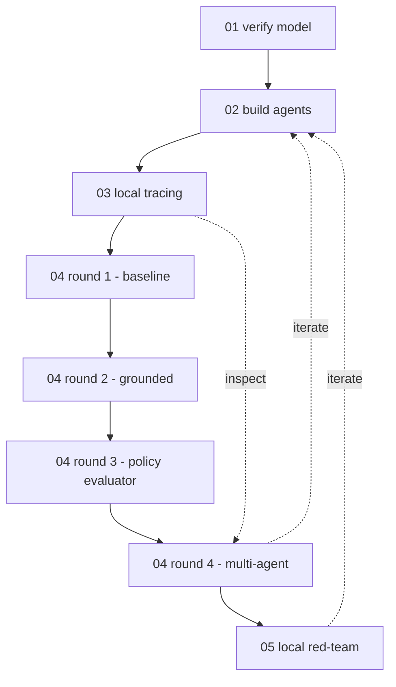

# Lab 1 — Multi-Agent Travel Concierge with Microsoft Agent Framework

> ⏱ ~60 min · 5 notebooks · prerequisites: [Lab 0](../lab-0-setup/SETUP.md) complete, Cohere `command-a` deployed, env vars populated from `cohere/sample.env`.
>
> **How to run:** open the notebooks in numbered order (`01` → `05`) and run all cells in each. Everything in this lab runs on your own machine — no agent ever lives in the Foundry portal.

**You are here:**

## 1. Why this lab exists

Microsoft Foundry has two ways to run an AI agent:

1. **Hosted Foundry Agent Service** — Foundry stores the agent definition, runs it, and shows it in the portal. This is the hosted path.
2. **Local agent runtime** — you write the agent in your own code and call the model deployment from there.

The hosted Agent Service does not support Cohere models today. So if you want a Cohere-powered, multi-agent travel concierge, you build it **locally** with the **Microsoft Agent Framework** (MAF) and point it at the same Cohere `command-a` deployment in your Foundry project. That is exactly what this lab does.

**MAF** is Microsoft's open-source library for building agents in Python. Think of it as a small kitchen on your laptop: you bring the same ingredient (the model deployment) the hosted restaurant uses, but you cook the dish yourself. Because the kitchen is yours, you can put any chef in it — including Cohere.

## 2. What you will build

A travel desk staffed by four agents. Three specialists each know one part of the trip, and one concierge orchestrates them.

**Figure 1 — Local multi-agent travel concierge.**

Each specialist owns the matching `search_*` and `book_*` tools from the catalogs module, reused verbatim. The concierge does not call those tools directly — it calls each specialist as if it were a single tool, and the specialist decides which catalog functions to run. This pattern is called **agents as tools**.

## 3. What you will do

1. Confirm MAF can reach the Cohere `command-a` deployment through `FoundryChatClient`.
2. Wire the three specialist agents and the concierge orchestrator with `agent_framework.Agent`.
3. Turn on **local tracing** so every concierge turn, specialist hop, and tool call is captured as an OpenTelemetry span (printed to the console and, when configured, sent to Application Insights so the Foundry Monitoring tab lights up).
4. Run a **four-round evaluation arc** with `azure-ai-evaluation` on a 20-prompt workshop dataset (`04-eval-dataset.jsonl`) so the scores stay comparable across runs:
   - **Round 1 — baseline:** bare MAF agent with generic instructions.
   - **Round 2 — grounded:** same agent, instructions now include the travel policy and catalog summaries.
   - **Round 3 — custom policy evaluator:** add a `PolicyAdherenceEvaluator` (LLM-as-judge) on top of the built-in graders.
   - **Round 4 — multi-agent + tools:** swap the prompt-only agent for the full multi-agent concierge with booking tools.
5. Run a **local red-team scan** with `azure.ai.evaluation.red_team.RedTeam` against the in-process concierge.

A **red-team scan** is a safety test where probe prompts try to make the agent break the rules — a mystery shopper for the concierge desk. Running it locally means the prompts are generated by the scanner on your machine and routed through your local concierge, while the scan results still upload to your Foundry project for the team to review.

**Tracing** is the third pillar alongside evaluations and red-teaming. Evaluations score answers, red-team probes catch unsafe behavior, and tracing shows the exact path a single request took through the concierge and its specialists. Together they tell you *how good*, *how safe*, and *how it happened*.

## 4. Notebooks

1. `01-verify-cohere.ipynb` — confirm the MAF `FoundryChatClient` can chat with `command-a`.
2. `02-build-multi-agent.ipynb` — assemble the four agents and run end-to-end smoke prompts.
3. `03-trace-multi-agent.ipynb` — enable MAF's OpenTelemetry instrumentation, run a multi-leg trip, and read the resulting spans locally (and optionally in App Insights).
4. `04-eval-round1-baseline.ipynb` — **Round 1.** Bare MAF agent, generic instructions, no tools. Run the built-in evaluator panel (Relevance, Coherence, Fluency, Groundedness, plus the agentic evaluators that are available in your install) to set the baseline scores.
5. `04-eval-round2-grounded.ipynb` — **Round 2.** Inject the travel policy and catalog summaries into the agent instructions and rerun the same evaluator panel. Compare against round 1.
6. `04-eval-round3-policy-evaluator.ipynb` — **Round 3.** Add the custom `PolicyAdherenceEvaluator` to the panel and rerun the grounded agent. Catches policy violations that the generic evaluators miss.
7. `04-eval-round4-multi-agent.ipynb` — **Round 4.** Swap the single grounded agent for the full multi-agent concierge (flight + hotel + car specialists with booking tools). Same dataset, same panel — only the target changes.
8. `05-local-redteam.ipynb` — point the `RedTeam` scanner at the local concierge target.

**Figure 2 — Build, trace, evaluate, scan loop.**

## 5. Supporting files

- `agents/travel_agents.py` — factory functions that build the chat client and the four agents, plus a `build_baseline_agent` helper used by rounds 1-3. Uses the local `tools/booking_tools.py` module against the JSON catalogs in `data/` so the lab folder is self-contained.
- `evaluators/policy_adherence.py` — custom LLM-as-judge that grades each response against `data/travel-policy.md`. Used by rounds 3 and 4.
- `requirements.txt` — MAF plus `azure-ai-evaluation[redteam]`. Chained from the root `requirements.txt` so Codespaces installs it automatically.

## 6. Setup

### Codespaces (recommended)

1. Open this repository in GitHub Codespaces.
2. Wait for the devcontainer to finish — `requirements.txt` is installed automatically, including this lab's dependencies.
3. Make sure `cohere/.env` contains your Lab 0 values (`FOUNDRY_PROJECT_ENDPOINT`, `COMMAND_A_DEPLOYMENT`, `AZURE_SUBSCRIPTION_ID`, `AZURE_RESOURCE_GROUP`, `FOUNDRY_PROJECT_NAME`).
4. Run `az login` in the Codespaces terminal so `DefaultAzureCredential` can authenticate.

### Local machine (alternative)

1. Create and activate a Python 3.12 virtual environment.
2. `pip install -r requirements.txt` from the repository root.
3. Copy `cohere/sample.env` to `cohere/.env` and fill in the values from your Foundry project (or copy the `.env` you already populated in Lab 0).
4. `az login --tenant <your-tenant-id>`.

## 7. What you learned

1. MAF lets you build a Cohere-powered multi-agent system with an open-source framework while using models deployed in Microsoft Foundry.
2. The agents-as-tools pattern is enough to coordinate three specialists from a single concierge without bringing in a heavier workflow graph.
3. MAF's built-in OpenTelemetry instrumentation captures every agent turn, specialist hop, and tool call as a span, so the Foundry Monitoring tab works the same way whether the agent is hosted or local.
4. The same evaluation dataset and the same `azure-ai-evaluation` package can score either a Foundry-hosted agent or a local MAF agent, so the metrics stay comparable across labs.
5. Local red-team scans let you stress-test a model endpoint that the hosted scanner cannot target on its own.

---

**← Prev** [Lab 2 — Cohere capabilities](../lab-2-cohere-capabilities/README.md) · **↑** [Workshop home](../README.md)
